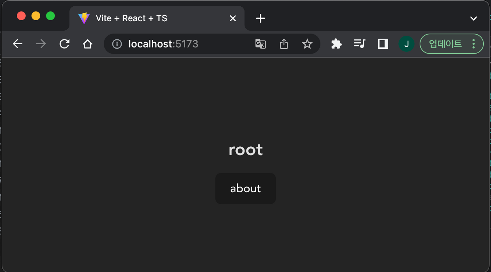
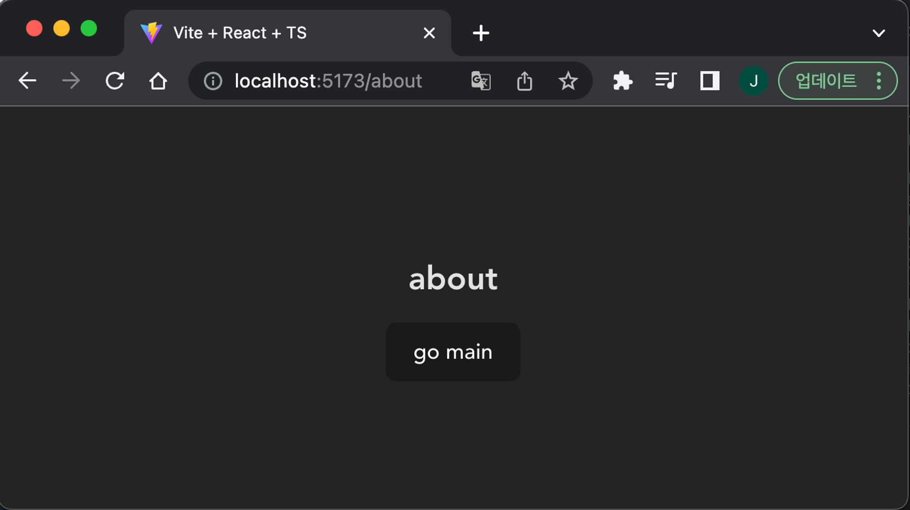
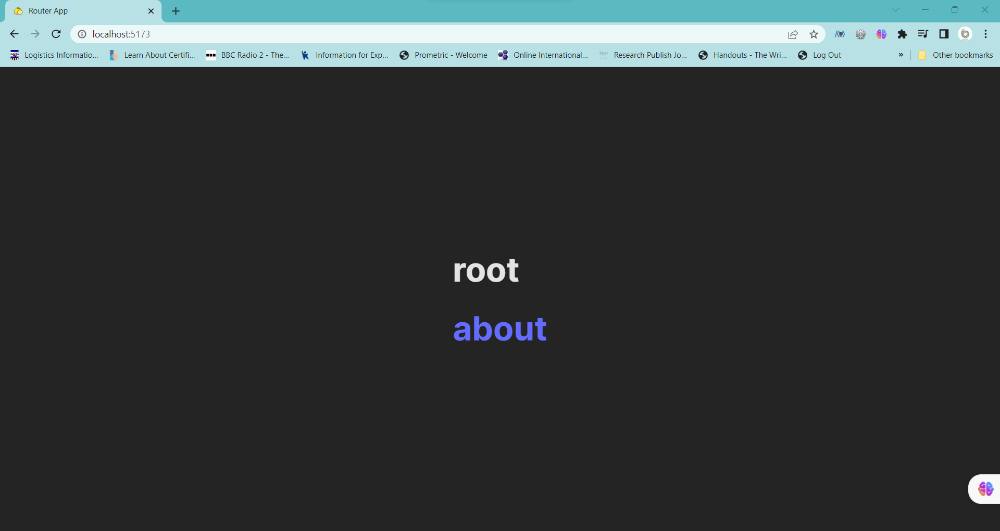
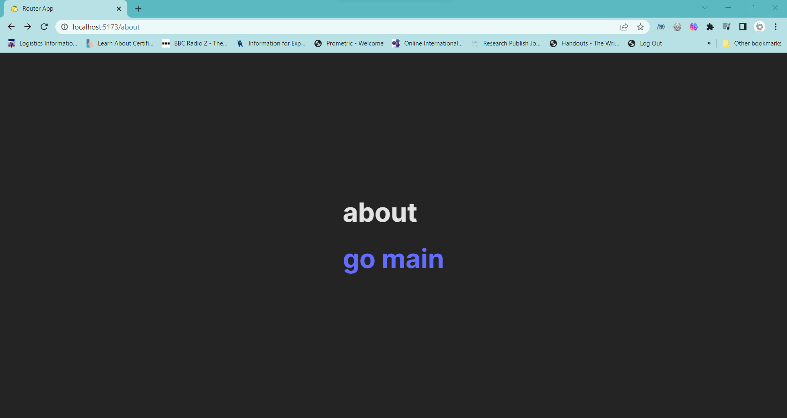
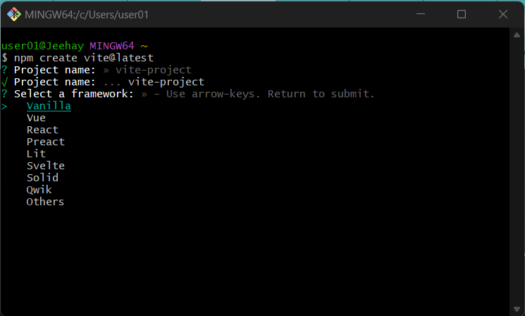

## ✏️ React와 History API 사용하여 SPA Router 기능 구현하기

### 1. `react-router-dom` library 사용하지 않고 'Router'와 'Route' 기능 구현

### 2. 세부사항

#### 1) 해당 주소로 진입했을 때 아래 주소에 맞는 페이지가 렌더링 되어야 한다.
- / → root 페이지
- /about → about 페이지

#### 2) 버튼을 클릭하면 해당 페이지로, 뒤로 가기 버튼을 눌렀을 때 이전 페이지로 이동해야 한다.
- 참조 : `window.onpopstate`, `window.location.pathname`,  `history.pushState()`

#### 3) Router, Route 컴포넌트를 구현해야 하며, 형태는 아래와 같아야 한다.

```
ReactDOM.createRoot(container).render(
  <Router>
    <Route path="/" component={<Root />} />
    <Route path="/about" component={<About />} />
  </Router>
);
```

#### 4) 최소한의 push 기능을 가진 useRouter Hook을 작성한다.
- `const { push } = useRouter();`


#### 5) 아래 스크린샷을 참고하여 앱을 작성한다.
- TO-BE) Root 경로


- TO-BE) About 경로


### 3. 구현 과정
#### Components 생성
- `<Route>`

`window.location.pathname` : a property that returns the path portion of the current URL. 

```
export default function Route ({ path, element }) {
    const currentPath = window.location.pathname;
    console.log(currentPath);

    if (currentPath.startsWith(path)) {
        return element;
      } else {
        return null;
      }
}

```

- `<Router>`

`Window: popstate event` : `popstate` event is fired when the user navigates through the session history of the browser.

```
export default function Router({ children }) {
  const [currentPath, setCurrentPath] = useState(window.location.pathname);

  // path 이동 시 currentPath에 저장

  useEffect(() => {
    const handlePopstate = () => {
      setCurrentPath(window.location.pathname);
    };

    window.addEventListener('popstate', handlePopstate);

    return () => {
      window.removeEventListener('popstate', handlePopstate);
    };
  }, []);

  // path에 각각의 component 할당하여 렌더링 되도록 함
  let componentToRender = null;

  switch (currentPath) {
    case '/':
      componentToRender = <Home />;
      break;
    case '/about':
      componentToRender = <About />;
      break;
  }

  return <div>{componentToRender}</div>;
}
```

- `<About>`

`window.history.pushState`: 
  - a method that allows you to manipulate the browser's history by adding a new state to the history stack without triggering a page refresh.

  - commonly used in Single Page Applications (SPAs) and client-side routing to update the URL and maintain proper navigation without causing a full page reload. It allows for seamless transitions between different application states without disrupting the user experience.

- It takes three parameters: state(optional), title(optional), and url(optional).

```
export default function About() {
    
    const navigateToMain = () => {
        window.history.pushState(null, '', '/');
      };

    return (
        <>
        <div className="center">
            <h1>about</h1>
            <!-- <a href="/" onClick={navigateToMain}> -->
            <a href="/">
                <h1>go main</h1>
            </a>
        </div>
        </>
    )
}

```

- `<Home>`
```
export default function Home() {
  const navigateToAbout = () => {
    window.history.pushState(null, '', '/about');
  };

  return (
    <>
      <div className="center">
        <h1>root</h1>
        <a href="/about" onClick={navigateToAbout}>
          <h1>about</h1>
        </a>
      </div>
    </>
  );
}
```

🎯 `window.history.pushState`를 사용하지 않는다면?

 Without using `window.history.pushState` or any other technique to prevent a full page reload, clicking on a regular link or navigating to a new URL will trigger `a full page reload`. In this case, the browser will discard the current page, send a new request to the server for the new URL, and load a completely fresh HTML document from the server.

During a full page reload, all resources (HTML, CSS, JavaScript, images, etc.) are fetched from the server again, the entire page is reconstructed and rendered from scratch, and any existing state or data in the current page is lost. It's essentially like loading a new web page.

A full page reload can be slower and less efficient compared to using client-side rendering techniques, where only specific parts of the page are updated without reloading the entire page. By using techniques like `window.history.pushState` and client-side routing, you can navigate within your application without triggering full page reloads, resulting in a more seamless and responsive user experience.

### 4. 구현 결과
- TO-BE) Root 경로


- TO-BE) About 경로



### 👏 5. 느낀 점
- Vite를 처음 사용해 보았는데, git bash에서 방향키를 사용할 수가 없어 여러번 app 설치를 시도해 보다가 [Stack overflow](https://stackoverflow.com/questions/55753151/cant-use-arrow-keys-in-git-bash-windows)에서 답을 찾았다.

>> You can use Visual Studio Code terminal and it works.

>> Git bash doesn't support an interactive terminal.

>> 

- 문제를 잘못 파악해서 처음에 `react-router-dom` library를 사용해서 간단하게 구현했는데, 제한 조건을 점검하던 중, 문제의 의도가 library를 사용하지 않고 직접 `<Route>`, `<Router>`component를 만들어 사용하는 것이라는 것을 한참 후에 깨닫게 됐다. 😊

- `window.history.pushState`를 사용여부의 차이가 궁금해서 `<a href="/about" onClick={navigateToAbout}>`와 `<a href='/'>`를 유관 상으로 확인해 보았는데, 간단한 페이지라서 눈으로 확인할 수 있는 차이가 없었다. 
`window.history.pushState`를 사용하지 않아도, 페이지 이동도 가능하고 렌더링도 똑같이 가능하지만, 'a full page reload'가 발생해서 서버에서 'all resources (HTML, CSS, JavaScript, images, etc.)'를 다시 가져와야 된다고 하니, 왜 사용해야 하는지 이해하게 됐다.

- 'a full page reload'는 CSR 렌더링보다 느리고 비효율적이라고 해서, CSR과 SPA의 밀접한 연관성을 확인해 보았다.

>> CSR (Client-Side Rendering) is closely related to SPA (Single Page Application) architecture.

>> In a Single Page Application, the initial HTML document is loaded from the server, usually containing minimal content and JavaScript files. Subsequent rendering and updates of the application's views and components occur on the client-side, within the browser, **without requiring full page reloads**.

- 'a full page reload' 발생하지 않도록 하는 것이 SPA의 기본 원칙에 부합하는 것이라는 것을 알게 됐다.

>> In the context of a Single Page Application (SPA), a full page reload refers to the complete refresh and reloading of the entire web page, typically triggered by navigating to a new URL or performing a specific action. When a full page reload occurs in an SPA, it typically indicates a departure from the intended behavior and principles of an SPA architecture.

>> SPAs are designed to avoid full page reloads and provide a more seamless and responsive user experience by dynamically updating specific parts of the page without requiring a complete page refresh. The idea is to leverage client-side rendering and asynchronous data loading to minimize server requests and provide a smoother user interface.

>> If a full page reload is performed in an SPA, it can disrupt the SPA's core principles and result in a less optimal user experience. The entire page is loaded from the server again, causing a delay and potential loss of any application state or data that was previously loaded and displayed.

>> While occasional full page reloads may still occur in an SPA due to specific requirements or certain scenarios, the main goal of an SPA is to minimize these reloads and maintain a persistent application state while providing a responsive and interactive user interface.

>> Therefore, if an application frequently relies on full page reloads rather than utilizing client-side rendering and dynamic updates, it may not fully align with the principles and benefits of an SPA architecture.


